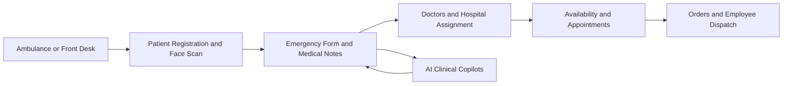

<div align="center">


<p>
	
</p>

<p>
	
	
	
	
	
</p>

<p>
	<a href="#-quick-start">Quick Start</a> •
	<a href="#-core-capabilities">Capabilities</a> •
	<a href="#-architecture-snapshot">Architecture</a> •
	<a href="#-tech-stack">Tech Stack</a> •
	<a href="#-contributing">Contributing</a>
</p>

</div>

---

## Overview

MedScan360 is a full-stack emergency care platform that connects ambulance teams, doctors, hospital staff, and patients in one continuous workflow.

From first contact to follow-up, the app helps teams register patients quickly, capture emergency context, route clinical data, coordinate doctor availability, and use AI copilots for medical documentation.

## Why This Repo Feels Different

<table>
	<tr>
		<td width="33%"><strong>End-to-End Operations</strong><br/>Intake, triage, OPD, appointments, messaging, and logistics in one codebase.</td>
		<td width="33%"><strong>Embedded AI Copilots</strong><br/>Purpose-built Genkit flows for notes, summaries, OPD slips, and symptom support.</td>
		<td width="33%"><strong>Production-Oriented Stack</strong><br/>Next.js App Router + Prisma + typed APIs + modular UI foundations.</td>
	</tr>
</table>

## Core Capabilities

### Emergency and Patient Operations

- Patient registration with structured medical profile data
- Face-scan-assisted identification flow
- Emergency form generation and rapid information handoff
- Longitudinal medical notes attached to patient records
- All-patients views for fast lookup and management

### Doctor and Hospital Workflows

- Doctor and hospital management modules
- Availability scheduling per doctor
- Appointment booking with token numbers
- Doctor-patient conversation threads with message history

### Field and Logistics

- Live location views and geolocation integration
- Ambulance-oriented tracking and coordination pages
- Order management with line items, delivery status, and employee assignment

### AI Copilot Suite

Located in `src/ai/flows`:

- `face-recognition-flow.ts`
- `notes-generator-flow.ts`
- `opd-slip-flow.ts`
- `prescription-helper-flow.ts`
- `report-summarizer-flow.ts`
- `symptom-checker-flow.ts`

Genkit is configured with Gemini 2.0 Flash and a Flash Lite fallback model for resiliency.

## Architecture Snapshot



## Tech Stack

| Layer | Tools |
|---|---|
| Frontend | Next.js 15, React 18, TypeScript |
| UI | Tailwind CSS, Radix UI, Lucide |
| Data | Prisma ORM, SQLite |
| Validation and Forms | Zod, React Hook Form |
| AI | Genkit + Google AI plugin |
| Maps and Geo | @react-google-maps/api + browser geolocation |
| Visualization | Recharts |

## Project Structure

```text
src/
	app/
		api/                 # Route handlers for auth, patients, doctors, appointments, messages
		register/            # Patient intake flows
		emergency-form/      # Emergency reporting
		doctors/             # Doctor and schedule management
		orders/              # Medication/logistics orders
		live-location/       # Live mapping and location interfaces
		user-dashboard/      # User-facing AI and operations entry points
	ai/
		flows/               # Genkit medical assistant flows
	components/
		dashboard/ forms/ ui/# Reusable product UI components
	context/
		AuthContext.tsx
		PatientDataContext.tsx
prisma/
	schema.prisma          # Domain model: Patient, Doctor, Appointment, Order, etc.
	migrations/            # Incremental schema migrations
```

## Quick Start

### 1. Prerequisites

- Node.js 20+
- npm

### 2. Install dependencies

```bash
npm install
```

### 3. Configure environment

Create a `.env` file in the project root:

```bash
DATABASE_URL="file:./dev.db"
NEXT_PUBLIC_GOOGLE_MAPS_API_KEY="your_google_maps_key"
GOOGLE_API_KEY="your_google_ai_key"
```

Notes:

- `NEXT_PUBLIC_GOOGLE_MAPS_API_KEY` is required for map-based views
- `GOOGLE_API_KEY` is required for Genkit Google AI flows

### 4. Prisma setup

```bash
npm run prisma:generate
npm run prisma:migrate
```

Optional seed:

```bash
npm run prisma:seed
```

### 5. Run the app

```bash
npm run dev
```

The app runs on http://localhost:9003.

## Available Scripts

- `npm run dev`: Start Next.js with Turbopack on port 9003
- `npm run build`: Production build
- `npm run start`: Run production server
- `npm run lint`: Run lint checks
- `npm run typecheck`: TypeScript checks without emit
- `npm run genkit:dev`: Start Genkit dev runtime
- `npm run genkit:watch`: Start Genkit runtime in watch mode
- `npm run prisma:generate`: Generate Prisma client
- `npm run prisma:migrate`: Run development migrations
- `npm run prisma:seed`: Seed initial data

## API Surface Highlights

Representative route groups under `src/app/api`:

- `auth`: login, logout, employee-login
- `patients`: CRUD, notes, bulk delete, profile migration
- `doctors`: CRUD, specializations, availability, appointments, messaging
- `hospitals`: hospital management endpoints
- `appointments`: booking and scheduling endpoints
- `messages`: communication endpoints
- `notifications/emergency`: emergency notification workflows

## Data Model Highlights

The Prisma schema includes:

- Patient and PatientProfile
- MedicalNote
- User with patient linking (UserPatient)
- Doctor and Hospital
- Availability and Appointment
- Conversation and Message
- Order, OrderItem, and Employee assignment

This enables both clinical continuity and operational logistics in one relational model.

<details>
	<summary><strong>Show Growth-Ready Design Principles</strong></summary>

- Modular route groups in the App Router
- Context-driven state boundaries
- Reusable UI primitives under components/ui
- Incremental Prisma migrations for safe evolution
- AI flows isolated by responsibility

</details>

## Contributing

1. Fork the repository
2. Create a feature branch
3. Commit focused changes with clear messages
4. Run lint, typecheck, and relevant manual flow checks
5. Open a pull request with screenshots and test notes

## Vision

MedScan360 aims to become the operating layer for emergency-to-outpatient continuity, where patient context, clinician decisions, and logistics move as one system.

If you are building modern healthcare software, this codebase gives you a serious, practical head start.


